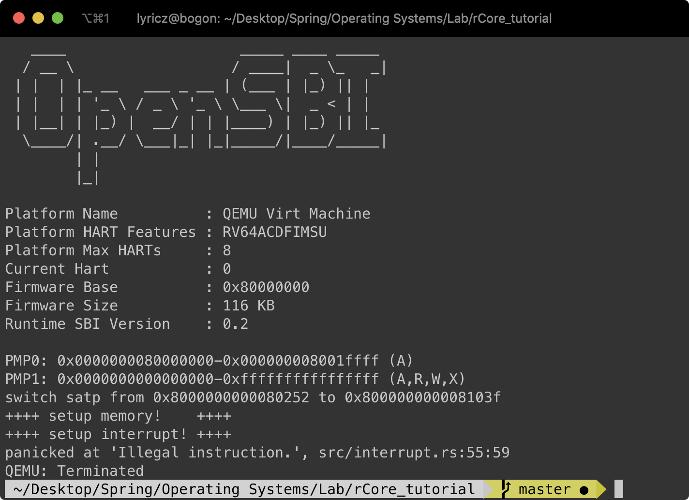

## rCore-Lab-1 中断异常

> 赵成钢 计75班 2017011362

#### 要求一：完成环境搭建并编译运行1~3章
- 因为我已经提前写了一段时间了，所以我个人根据教程完成了一个版本（参见：https://github.com/LyricZhao/rCore-OS），其中我根据自己的理解修改了很多结构和命名（其实本质一样）。但是为了完成Lab的方便，我在这里直接根据`rCore_tutorial`的`master`继续开发，没有使用我自己的版本。

#### 要求二：描述rCore处理中断异常的流程
- 由于我们设置了Direct模式，所以一旦发生异常，PC就会直接跳转到`__alltraps`
- 跳转后先把当前的程序上下文保存到栈上
- 然后把当前栈顶（相当于传入了`&TrapFrame`）作为参数传入`rust_trap`函数
- 之后rust_trap函数会根据Frame中的信息判断异常的类型，做出不同的处理
- 处理完成后，会从`jal rust_trap`中返回，继续执行`__trapret`
- `__trapret`会把上下文恢复，最后用`eret`跳转回去（根据`sepc`跳转）

#### 要求三：`__alltraps`需要保存所有寄存器吗
- 我认为需要，因为我们不知道后面中断处理程序会用到哪些寄存器
- 而且还可能出现嵌套异常的情况，比如在`rust_trap`中加入`ebreak`，这样大量上下文信息必须保存
- （除非，在`__alltraps`中提前对异常进行分类，然后用汇编处理，这样我就会知道用哪些寄存器，剩下的就不用保存）

#### 要求四：触发指令异常捕获并处理
- 我使用了`mret`来触发异常（在异常初始化之后）
    ```rust
    // For lab-1
    unsafe {
        asm!("mret"::::"volatile");
    }
    ```
    
- 并在处理处加入了
    ```rust
    Trap::Exception(Exception::IllegalInstruction) => panic!("Illegal instruction."), // For lab-1
    ```
    
- 助教可以搜索`For lab-1`来寻找对应代码，或者直接运行`make run`进行测试（会看到`panic`的信息）

    

