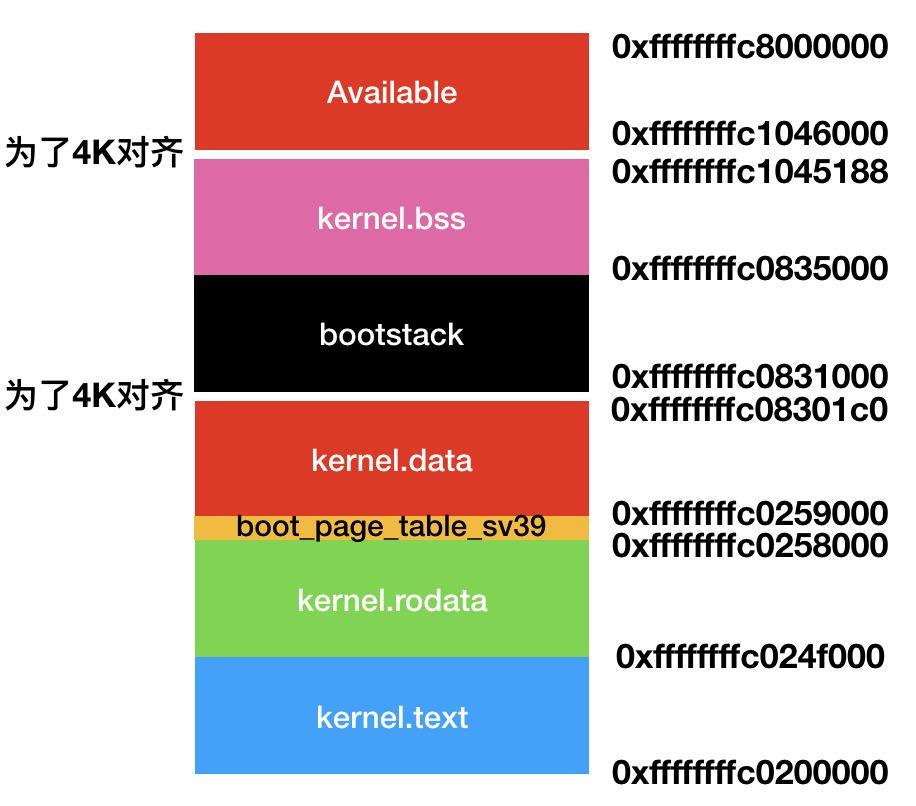

## rCore-Lab-3 虚拟内存管理

> 赵成钢 计75班 2017011362

#### 要求一：完成环境搭建并编译运行第5章
因为我已经提前写了一段时间了，所以我个人根据教程完成了一个版本（[地址](https://github.com/LyricZhao/rCore-OS)），其中我根据自己的理解修改了很多结构和命名（其实本质一样）。但是为了完成Lab的方便，我在这里直接根据`rCore_tutorial`的`master`继续开发，没有使用我自己的版本。

#### 要求二：详细画出kernel_remap之后的内核页表（原来的要求）

- 首先，我在`MemoryArea`中添加了输出语句：

  ```Rust
  println!("Mapping [{:#x}..{:#x}) to [{:#x}..{:#x})", self.start, self.end, self.start - PHYSICAL_MEMORY_OFFSET, self.end - PHYSICAL_MEMORY_OFFSET);
  ```

- 并在push完`bootstack`段之后加一个死循环，观察输出

- 也就是如下的结构

  

- 我们发现所有的段开始地址最后三位都是0，说明已经进行了4K对齐，那么从开始地址到结束地址的页，只需要减去`PHYSICAL_MEMORY_OFFSET`就可以得到物理地址，只要我们对这里面所有的地址进行了对应的Page→Frame的映射就完成了页表。

- 那么对应的页表也就是：

  | 虚拟页范围                         | 物理帧范围         | 备注      |
  | ---------------------------------- | ------------------ | --------- |
  | [0xffffffffc0200, 0xffffffffc024e] | [0x80200, 0x8024e] | text      |
  | [0xffffffffc024f, 0xffffffffc0257] | [0x8024f, 0x80257] | rodata    |
  | [0xffffffffc0259, 0xffffffffc0830] | [0x80259, 0x80830] | data      |
  | [0xffffffffc0831, 0xffffffffc0834] | [0x80831, 0x80834] | bootstack |
  | [0xffffffffc0835, 0xffffffffc1045] | [0x80835, 0x81045] | bss       |
  | [0xffffffffc1046, 0xffffffffc7999] | [0x81046, 0x87999] | Avaibable |

- `0x88000000`正好是`PHYSICAL_MEMORY_END`

#### 要求二：目前页面替换算法的实现问题（新的要求）

- `do_pgfault`在找到可替换页之后，没有把替换进去的物理页`push`到算法中去，解决方法就是重新写这个函数
- 剩下大体上的就找不出来了（另外感觉框架写的不是很软工和fancy）

#### 要求三：实现时钟页面替换算法

- 类似`FifoPageReplace`，我实现了`ClockPageReplace`，并同样用`VecDeque`来维护在内存中的页，不同的是，选择被替换页时根据算法本身循环选择没有被访问过的页，并清除访问标记。

- `choose_victim`具体实现见下：

  ```rust
  fn choose_victim(&mut self) -> Option<(usize, Arc<Mutex<PageTableImpl>>)> {
  	let mut i = 0;
  	loop {
  		let index = (i + self.current) % self.frames.len();
  		let (vaddr, pt) = self.frames.get(index).as_mut().unwrap();
  		if pt.lock().get_entry(*vaddr).unwrap().accessed() {
  			pt.lock().get_entry(*vaddr).unwrap().clear_accessed();
  		} else {
  			let ret = self.frames.remove(index);
  			self.current = if self.frames.len() > 0 {
  				index % self.frames.len()
  			} else {
  				0
  			};
  		return ret;
  		}
  		i += 1;
  	}
  	unreachable!()
  }
  ```