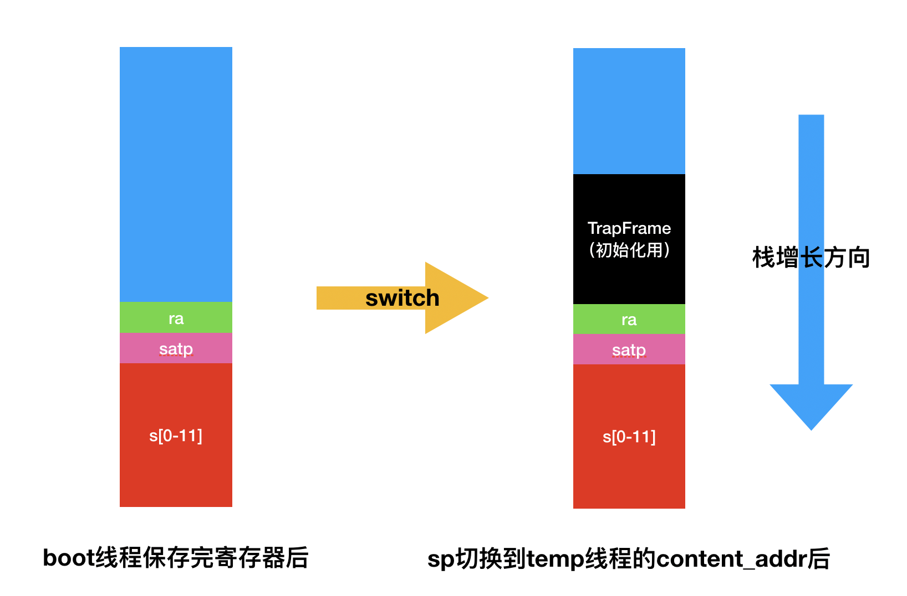

## rCore-Lab-4 线程管理

> 赵成钢 计75班 2017011362

#### 要求一：完成环境搭建并编译运行第6章
因为我已经提前写了一段时间了，所以我个人根据教程完成了一个版本（[地址](https://github.com/LyricZhao/rCore-OS)），其中我根据自己的理解修改了很多结构和命名（其实本质一样）。但是为了完成Lab的方便，我在这里直接根据`rCore_tutorial`的`master`继续开发，没有使用我自己的版本。

#### 要求二：描述`process::init`的执行过程

- 首先拿到当前的线程（从OpenSBI启动一直在执行的当前的boot线程）
  - 当前的线程已经有栈了
  - 上下文也不需要重新构造
- 然后构造一个新内核（特权态）线程（申请一段空间大小为`KERNEL_STACK_SIZE`作为内核栈）
- 新的内核线程的入口是一个函数`fn temp_thread(...)`，我们可以用上下文中的`TrapFrame`为其传参
- 然后把`boot`线程切换到`temp`线程
- `temp`线程开始运行，会打印一句话，然后切换回`boot`线程
- `switch`函数是如何切换的？
  - `switch`函数有两个参数`switch(&mut self, _target: &mut Context)`，即当前的上下文和目标上下文
  - 首先我们把当前的寄存器保存下来（不需要保存全部，只需要保存callee-saved，caller-saved寄存器的保存会让编译器来做，这也是不能内联的原因）
  - 然后把目标上下文的寄存器信息恢复到寄存器中
  - 这时候把栈指向`Content`中`TrapFrame`，PC跳到`__trapret`中，其实就起到了初始化（注意仅仅是第一次是，第二次切换会变成`switch_to`之后下一条指令的地址）的作用，而且也可以通过这种机制来传递参数

#### 要求三：给出`switch`时寄存器具体情况，画出栈的使用情况

- 如图所示是栈的使用情况

  

- 切换回来的时候情况类似，只不过`temp`线程的`TrapFrame`就没有用了
- 关于重要的寄存器
  - `ra`：切换到`temp`时`ra`为`__trapret`，`__trapret`用`epc`寄存器返回到线程入口
  - `satp`：用于页表切换
  - `s[0-11]`：callee-saved寄存器，需要保存在栈中
  - `sp`：用于切换运行栈
  - `t[0-2]`：caller-saved，编译器会帮忙保存
  - `a[0-7]`：返回值和参数，编译器会帮忙保存，同时也用这个机制来对入口函数传参

