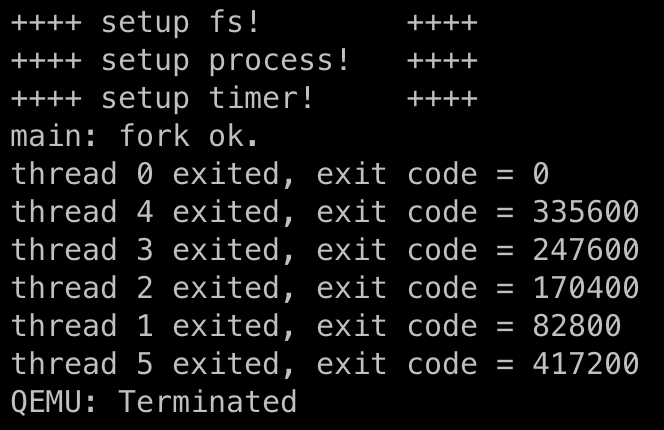

## rCore-Lab-6 CPU 调度

> 赵成钢 计75班 2017011362

#### 要求一：阅读理解文档第七章
#### 要求二：理解 Round Robin 算法

- 代码中的 Round Robin 算法通过 `push` 来添加线程到调度器，`pop` 来获取一个可以运行的线程，`tick` 来表示时间的流逝，`exit` 来退出。
- 算法层面上，代码通过循环（一个循环链表）调度器中每个线程，每次让每个线程运行满`max_time_slice`个时间片，然后释放并让下一个来运行。

#### 要求三：实现 Stride 算法

- 具体的算法见 uCore 的文档，这里不再赘述。

- 具体代码实现在 `process/scheduler.rs` 中的 `StrideScheduler`，将 `BIG_STRIDE` 定义为$8！=40320$（假设优先级是 1 到 8 的数字）。

- 实现并没有使用优先队列，而使用了一个双向链表，每次要插入或者改变线程的 `Stride` 值时就暴力向后找到合适的位置来维护单调性，为什么不用优先队列是因为可以发现我们向后暴力查找的复杂度是和后面一个个调度到这个插入的位置是一样的，也就是均摊还是 $O(1)$。

- 下面是一个运行截图：

  

  - 可以看到每个线程的时间基本上就是优先级成正比的（大概是 80000 的倍数）
  - 如果助教要评测的话，QEMU 需要等待的时间约在 10 秒左右，请耐心等待